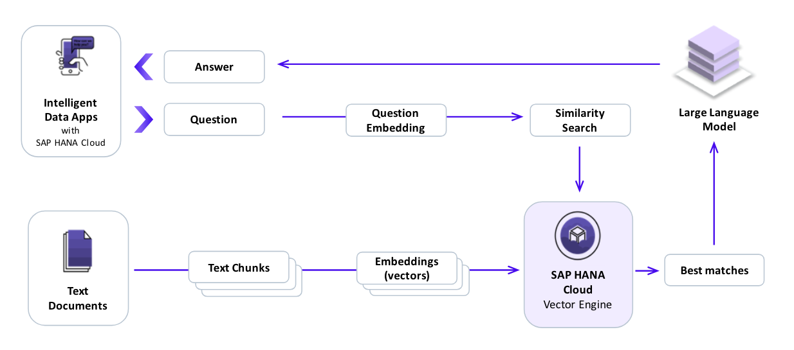

# SAP HANA Cloud with Vector Engine and GenAI Hub

<!-- Please include descriptive title -->

<!--- Register repository https://api.reuse.software/register, then add REUSE badge:

-->

## Description
In this use case, we will embark on a journey to explore the capabilities of SAP HANA Cloud vector engine, SAP Generative AI Hub and the Python Langchain Framework. The goal is to equip you with the knowledge and skills to handle unstructured and semi-structured data and build efficient applications.

## Requirements

SAP HANA Cloud Introduction Academy or Basic Trial registration.

## Setup and Installation

Beginning with setup via SAP Business Application Studio (BAS) and Jupyter notebook provided, execute the Python code installing libraries needed.

- **hdbcli**

> The Python Database API Specification v2.0 (PEP 249) defines a set of methods that provides a consistent database interface independent of the actual database being used. The Python extension module for SAP HANA implements PEP 249. Once you install the module, you can access and change the information in SAP HANA databases from Python.

- **generative-ai-hub-sdk**

> With this SAP python SDK you can leverage the power of generative Models like ChatGPT available in SAP Generative AI Hub.

- **Folium**

> Folium builds on the data wrangling strengths of the Python ecosystem and the mapping strengths of the Leaflet.js library. Manipulate your data in Python, then visualize it in a Leaflet map via folium.

- **Generative AI Hub configuration**
  
> Configure client access to SAP BTP Generative AI foundation-models.

 

> **Note** Jupyter Notebook kernel needs a restart after installation of libraries.

 

## Known Issues
No known issues.

## Contributing
We currently do not accept community contributions.

## License
Copyright (c) 2024 SAP SE or an SAP affiliate company. All rights reserved. This project is licensed under the Apache Software License, version 2.0 except as noted otherwise in the [LICENSE](LICENSE) file.
